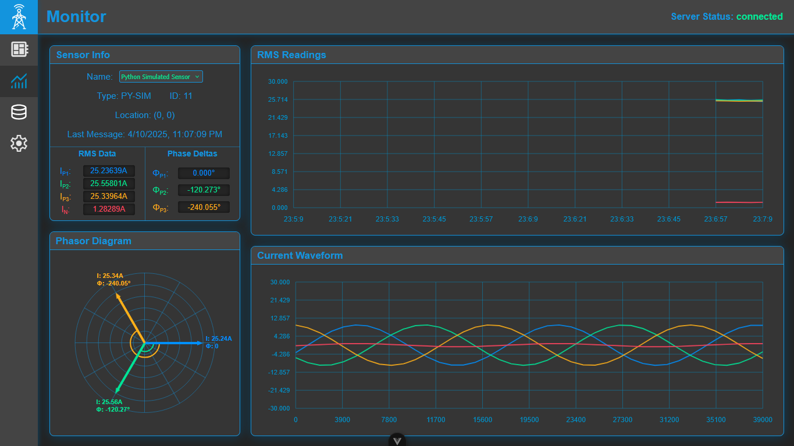

# LiveGrid

## Overview
LiveGrid is a realtime, wireless, current measurement and monitoring system intended for use with 3 phase power systems.\
It is based around a Particle Photon 2 and uses commercial oscilloscope current probes to measure currents at any voltage.\
It provides both realtime updates over the air as well as high speed long term data logging.\
LiveGrid features numerous backup features for both power and connection failure and is intended for "set it and forget it" operation for years at a time.\
 
**Please Note:** This is a work in progress school project that was completed for ENEL 400 at the University of Calgary

## Features
- Real-Time view of all wireless sensor data
- RMS, Waveform, and Phase information all updated once per second
- Long term storage of measurements in off site database
- Robust operation
   - Battery backup in case of power failure
   - SD card backup in case of connection failure
   - Untransmitted data is retransmitted upon reconnection
- Easy to use API for data access
- Intuitive web client allows for easy data visualization from anyone, anywhere

## Major Dependencies
- Node.js
- Vue.js
- Mosquitto
- PostgreSQL
- Particle Workbench / Build Tools

**Please Note:** All required node modules for client and server are present in the appropriate package.json files, All ParticleOS Libraries are present in [project.properties](/WiFi-Sensor-Firmware/project.properties)

## Components
- [Sensor Firmware](/WiFi-Sensor-Firmware/)
- [Sensor PCB](/Hardware/)
- [Node.js Web Server](/Server/)
- [PostgreSQL Database](/Database/)
- [Mosquitto Broker](/Broker/)
- [Vue.js Web Client](/client/)

## Authors
This project was created by:
- Liev Mitchell
- Asi Colombage
- Christine Gongon
- Kurt Layton
- Stephen Montgomery
- Anthony Truong

All software was written by Liev Mitchell

## License
All works in this repository are licensed with CC0. \
See [LICENSE.MD]()

## Images

